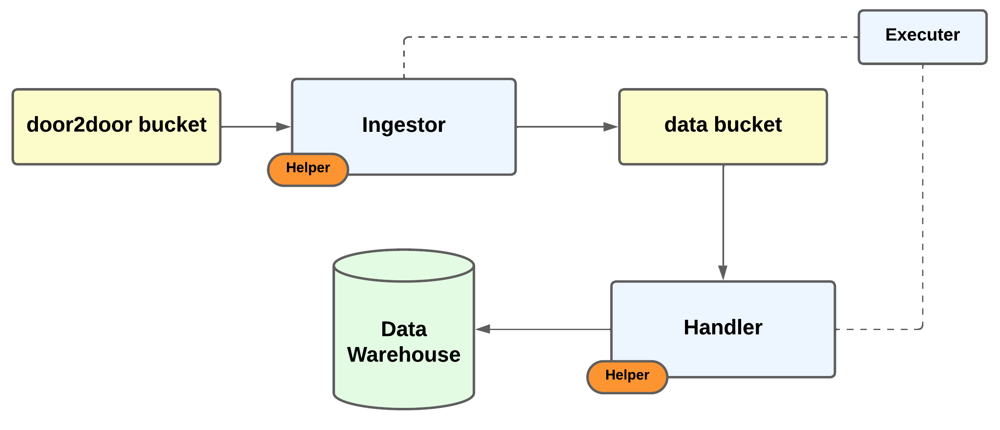

# 🚗 Door2Door ETL Solution

This project is designed to **extract JSON files** from a public S3 bucket (`de-tech-assessment-2022`) every hour and load them into a dedicated environment, enabling users to efficiently query and analyze the data.  
Below, you’ll find an overview of the solution, a breakdown of each component, and clear instructions for building and running the system.

---

## 🗺️ Solution Overview



---

## 📦 Project Structure

### **Executor**
The Executor acts as the entry point for the workflow. It parses input arguments and orchestrates the execution of the ETL steps. By default, it runs both the Ingestor and Handler sequentially, but you can also choose to run only one of these steps as needed. The various execution options are detailed in the "Build and Execute" section below.

---

### **Ingestor**
The Ingestor is responsible for:
- Fetching `.json` files from the public S3 bucket for a specific hour.
- Merging these files into a single JSON object.
- Uploading the consolidated file to a MinIO bucket (`door2door-files`), which simulates the data team’s storage.
- Tracking which hours have already been processed using the `monitor_db.ingestor_executions` table in the data warehouse.  
  - If no records exist, the process starts from `2022-11-24 10:00:00 UTC`.
- Logging execution metadata to the data warehouse for monitoring and traceability.

---

### **Handler**
The Handler processes the merged JSON files produced by the Ingestor:
- Downloads the consolidated JSON from the MinIO bucket.
- Splits the data into entities (e.g., `vehicles`, `operating_periods`).
- Converts each entity into a DataFrame, applying the strict schema defined in `schema_entities.yaml`.
- Generates unique identifiers for each record based on the schema.
- Loads the processed data into the appropriate tables in the data warehouse (`vehicle_location`, `operating_periods`).
- Records execution metadata in the `monitor_db.handler_executions` table.

---

### **Helper**
This module contains utility classes, functions, and YAML mapping files that support the ETL workflow, ensuring modularity and reusability across the project.

---

### **Data Warehouse**
A local Postgres instance serves as the data warehouse, providing a queryable environment for the final data.  
- **monitor_db**: Stores execution metadata (`ingestor_executions`, `handler_executions`).
- **data_warehouse_db**: Stores the actual processed data (`vehicle_location`, `operating_periods`).

---

## ⚙️ Build and Execute

### **1. Provision the Data Infrastructure**

Start the required services (MinIO and Postgres) using Docker Compose:

```sh
docker-compose up -d
```

---

### **2. Build the ETL Docker Image**

Build the ETL code container:

```sh
docker build -t etl-code-image .
```

---

### **3. Run the ETL Workflow**

You can run the ETL in several modes, depending on your needs:

- **Show all available parameters:**
  ```sh
  docker run --network etl-door2door_net etl-code-image
  ```

- **Run the full workflow (Ingestor + Handler):**
  ```sh
  docker run --network etl-door2door_net etl-code-image python3 executor.py
  ```

- **Run only the Ingestor:**
  ```sh
  docker run --network etl-door2door_net etl-code-image python3 executor.py -s ingestor
  ```

- **Run only the Handler (requires a valid WORKFLOW_ID):**
  ```sh
  docker run --network etl-door2door_net etl-code-image python3 executor.py -s handler -w <WORKFLOW_ID>
  ```
  > **Note:** You must provide an existing `WORKFLOW_ID`. All available workflow IDs can be found in the `monitor_db.ingestor_executions` table.

---

## 🛠️ Environment & Versions

- **Docker Compose:** v2.38.1-desktop.1  
- **Docker:** 28.3.0, build 38b7060

---

## 📑 Additional Notes

- The MinIO and Postgres services are configured via `docker-compose.yaml` and are networked together using a custom bridge network (`door2door_network`).
- All configuration and schema details are managed via YAML files and environment variables for flexibility and clarity.

---

## ☁️ AWS Environment Deploy


This section outlines how the ETL solution can be deployed in a scalable, production-grade AWS environment.

### Ingestor & Handler
- **Containerization:** Create a separate Dockerfile for both the Ingestor and Handler steps.
- **Image Storage:** Push the built images to Amazon Elastic Container Registry (ECR).
- **Execution:** Run each step as a job in an AWS Fargate ECS cluster, allowing for serverless, scalable, and cost-effective execution.

### Executor (Orchestration)
- **Recommended Approach:** Replace the current Executor with an open-source orchestrator such as **Airflow** or **Dagster**, or use a managed AWS service like **AWS Step Functions**.
- **Deployment Options:**
  - If using an open-source orchestrator, deploy it as a service within the same ECS cluster or on a dedicated EC2 instance.
  - If using AWS Step Functions, leverage its native integration with ECS.

### Data Warehouse
- **Redshift as Data Warehouse:** Use Amazon Redshift for data warehousing.
- **Optimized Data Loading:**
  - After the Handler parses each entity, write the processed data back to S3 as Parquet files (for efficient storage and querying).
  - Use the Redshift `COPY` command to load these Parquet files into temporary tables in the Redshift cluster.
  - Execute a `MERGE` statement to upsert data from the temporary tables into the main tables.
- **Advanced Querying:**
  - Leverage **Redshift Spectrum** and **AWS Glue Data Catalog** to create external tables on the Parquet files in S3, enabling point-in-time queries and further investigations whenever needed.

---
